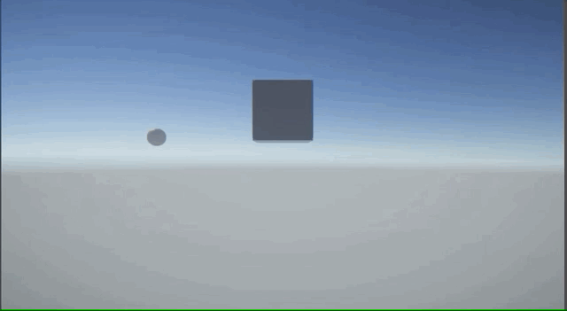

# Scroll Wheel Dolley Camera System.
This is Unity project.
This sample is Dolly camera control for webGL and more.

The camera control by use mouse scroll(center wheel).
Programable look at target changing by dolly rale positions.
And playable audio triger.

# motivation
I want to create interactive timeline story and directed image frame for beyond the interactive media experience.
In web experiments, showing by using simple controll such as mouse scroll, mouse click...
I want to make story and expression by using these simple controls.
And I made this project experimentally.
Thank you.

## Dependencies 
This project using cinemachine and do tween.
You can get package manager and unity asset store.
